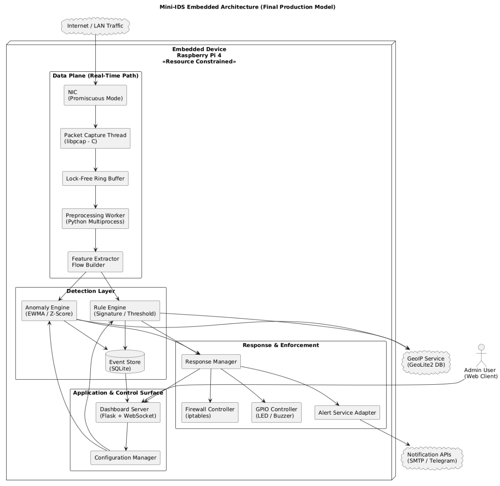
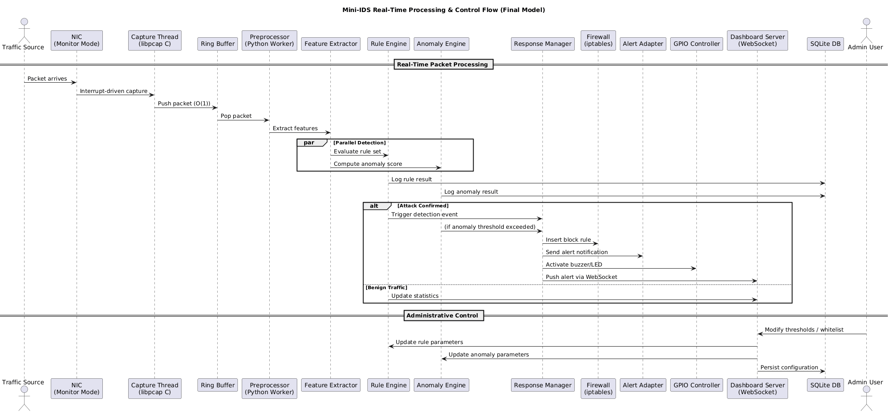

# <u>Project Proposal</u>

**Project title**: Embedded Network Intrusion Detection System (Mini-IDS) with Real-Time Dashboard.

**Course**: MICROPROCESSOR AND EMBEDDED SYSTEM.

**Program**: BSc in CSE.

**Team**: Sagar Biswas, \[\], \[\], \[\], \[\].

**Supervisor**: _______.

**Semester**: 2025-2026, Spring.

## 1. Executive summary

This project proposes a low-cost, practical Embedded Network Intrusion Detection System (Mini-IDS) built on a Raspberry Pi 4. The Mini-IDS will capture network traffic in a controlled lab environment, detect common network attacks using a mix of **rule-based** and lightweight **anomaly detection methods**, **send real-time alerts** by Email and Telegram, and provide a **web-based dashboard** for visualization and basic automated defense using **firewall rules** and **GPIO** alerts. The focus is on making a reproducible, well-documented system that can be evaluated on detection accuracy, latency, and resource usage.

## 2. Objectives

- Build a reliable **packet capture pipeline** on an embedded platform.
- **Detect** common **attacks** such as port scans, ICMP floods (ping packets), brute-force login attempts, and traffic spikes.
- Send **real-time alerts** via Email and Telegram.
- Provide a Flask-based **dashboard** with **live charts** and an **admin control panel**.
- Automatically **block** malicious IPs using iptables, with safe fail-safes.
- Evaluate **performance** and **document** results in a reproducible way.

## 3. System overview

The system runs on a Raspberry Pi 4 and consists of the following modules:

- Packet capture module using libpcap in C for low-latency capture.
- Lock-free ring buffer to safely hand packets from the capture thread to worker processes.
- Python preprocessing worker to extract flows and features.
- Detection engine combining signature/threshold rules and lightweight anomaly detection (EWMA, z-score).
- Response manager that triggers iptables rules, sends alerts, and controls LED/buzzer via GPIO.
- SQLite database for event logs and configuration.
- Flask dashboard with WebSocket updates and Chart.js visualizations.

<u>Data flow summary:</u> Network Interface Card (NIC) -> libpcap capture thread -> ring buffer -> preprocessing worker -> detection engine -> logging + response manager -> dashboard.

## 4. Detection design

### Rule-based detection

- Port scan: triggered when a source IP probes unique destination ports beyond a threshold inside a sliding window.
- ICMP flood: triggered when packets per second from a source exceed a configurable threshold.
- Brute-force login: detected by repeated failed HTTP POST login attempts from the same IP.
- Suspicious traffic spike: detected if packet rate deviates from an EWMA baseline by K standard deviations.

### Anomaly detection

- Entropy-based checks on payload distribution for common protocols.
- Per-IP z-score on packet size and packet rate distributions.
- Optional lightweight streaming model if time permits.

### False positive mitigation

- Whitelist known hosts.
- Require correlation across two independent detectors before auto-blocking.
- Admin override and manual unblocking from the dashboard.

## 5. Implementation plan and technologies

- Capture: C + libpcap for the hot path.
- Higher-level logic: Python 3.11 with multiprocessing.
- Dashboard: Flask + Flask-SocketIO, Chart.js.
- Storage: SQLite for persistent logs; Redis optional for ephemeral counters.
- Testing tools: nmap, hping3, tcpreplay for replay tests.
- Deployment: systemd service and an optional Dockerfile for reproducibility.

## 6. Testing and evaluation

Planned tests:

- Unit tests for rule logic.
- Integration tests for the full capture-to-response pipeline.
- Stress tests to measure packet loss, CPU, and memory under load.
- False positive tests with heavy benign traffic.

Key metrics to report:

- Detection rate and false positive rate.
- Mean detection latency and blocking latency.
- System CPU and memory usage under nominal and stress conditions.
- Packet loss rate in the capture pipeline.

Target goals (example): detection latency under 2 seconds, false positive rate under 5% on benchmark benign traffic, and packet loss below 1% under a specified packet-per-second baseline.

## 7. Safety and ethics

All experiments will be performed in a controlled lab network only. No testing will be performed on networks or hosts without explicit permission. Any logs released publicly will be anonymized. We will document ethical considerations and responsible testing procedures in the final report.

## 8. Deliverables

1. Source code repository with modular layout and tests.
2. Dockerfile and systemd service script.
3. Design documents and diagrams.
4. Test scripts and recorded pcaps.
5. Performance and evaluation report with graphs.
6. 5-7 minute demo video and presentation slides.
7. Viva appendix with likely questions and answers.

## 9. Timeline (8 weeks)

Week 1: Environment setup, capture module prototype in C, ring buffer test.\
Week 2: Preprocessing worker and feature extractor; test traffic scripts.\
Week 3: Implement core rule-based detection and unit tests.\
Week 4: Implement anomaly detector and whitelist/decay logic.\
Week 5: Response manager, iptables automation, and hardware alert integration.\
Week 6: Dashboard development and admin controls.\
Week 7: Stress testing, profiling, and threshold tuning.\
Week 8: Documentation, demo recording, final report, and presentation prep.

## 10. Risk analysis and mitigation

- Packet loss: mitigate with ring buffer, C capture thread, and reduced logging in the hot path.
- False positives: mitigate with correlation logic and manual override.
- SD card corruption or Pi crash: mitigate with read-only rootfs, backups, and watchdog.

## 11. Budget estimate

- Raspberry Pi 4: 10,000 - 15,000 BDT (recommend 4 GB).
- Microcontroller (optional): 800 - 1,500 BDT.
- Accessories and SD card: \~1,000 BDT.

No paid services are required; GeoLite2 and notification APIs are free to use at the basic level.

<a id="Mini-IDS_architecture_diagram"></a>

## 12. Architecture Diagram

Below is the architecture diagram for the Mini-IDS. It shows the Raspberry Pi boundary, the real-time data plane components, the detection layer, the response and enforcement components, and external services.



### Summary

Think of the Raspberry Pi as a small security checkpoint for a house. The diagram shows how the checkpoint watches incoming network traffic and decides what to do.

1. **Where traffic arrives**: Network traffic is like visitors arriving at the gate. The NIC is the gate where every packet first appears.
2. **Catching the packets quickly**: The capture thread is like a security guard who picks up each visitor as soon as they arrive. This guard works in a fast, low-level language so nothing is missed.
3. **Short holding area**: The lock-free ring buffer is a quick conveyor belt where the guard puts visitors for the rest of the team to check. It is very fast and does not slow things down.
4. **Preparing the data**: The preprocessing worker cleans and organizes the visitor information. The feature extractor turns each visitor into a short description the system can understand.
5. **Two kinds of checking**:

   The rule engine is like a list of known bad behaviors. If a visitor matches a known bad pattern, alarms go off.

   The anomaly engine is like a guard who notices strange behavior even if it is not on the list. It looks for unusual patterns.

6. **Saving events**: The SQLite event store is a simple notebook where the system writes down what it saw. This helps review or study later.
7. **Action and alerts**: The response manager decides what to do when something looks wrong. It can tell the firewall to block an IP, send messages through email or Telegram, or flash a buzzer or LED.
8. **Control and user view**: The dashboard is the control room where an admin can see live stats and change settings. External services like GeoIP and notification APIs are outside the checkpoint. They are like phone books or phone lines the system calls when needed.

<u>Why this is safe and neat</u>: Everything that directly inspects traffic stays inside the Raspberry Pi boundary. External services are kept outside so you know what is trusted and what is not.

<a id="Mini-IDS_sequence_diagram"></a>

## 13. Sequence Diagram

Below is the sequence diagram that details real-time packet processing, parallel detection, alerting, and the administrative control flow.



### Summary

This explains step-by-step what happens when a packet arrives and how the system reacts.

1. **Packet arrives**: A network packet arrives just like a car pulls up to a checkpoint.
2. **Immediate capture**: The NIC triggers the capture thread. This is like an instant bell that tells the guard to grab the car right away.
3. **Fast push into buffer**: The guard puts the packet onto the ring buffer. This push is O(1) which means it happens instantly and does not get slower if there are more packets.
4. **Preprocessing and feature extraction**: A worker pulls the packet from the buffer, cleans it, and extracts the important facts. This is like writing down the car’s license, color, and owner.
5. **Two checks at the same time**: The feature data goes to both the rule engine and the anomaly engine at the same time. Imagine two inspectors checking the same car in parallel. One checks a checklist of known bad behavior. The other looks for anything unusual.
6. **Logging results**: Each inspector writes a short note in the notebook (the SQLite DB) about what they found.
7. **If an attack is detected:**
   - The system goes into the attack branch:
     - The response manager gets the alert and tells the firewall to block the attacker. This is like closing a gate so a car cannot enter again.
     - It sends alert messages to an admin via email or Telegram.
     - It turns on a buzzer or LED to show an alarm.
     - It pushes a real-time alert to the dashboard so the admin sees it immediately.
8. **If traffic is normal**: The system just updates statistics on the dashboard and continues watching.
9. **Admin updates**: An admin can change thresholds or add trusted hosts from the dashboard. These new settings are saved to the notebook so the system remembers them.

<u>Why this workflow is smart</u>: The system captures packets very fast, checks them in parallel so it is quick, logs everything for later, and only takes action when needed. Admins can change settings without stopping the system.

## 14. Repository layout (suggested)

```text
mini-ids/
├─ capture/            # C capture code + build scripts
├─ detector/
│  ├─ rules/           # human-readable rules
│  ├─ anomaly/         # anomaly detector code
│  └─ tests/
├─ response/           # iptables controller, alerting
├─ dashboard/          # Flask app and static files
├─ tests/              # test traffic scripts, pcaps
├─ docs/               # design docs, API, grading rubric
├─ docker/             # Dockerfile, compose
├─ ci/                 # basic CI checks
└─ README.md
```


## 15. Q/A

### ICMP flood

**What:** A denial of service attack that overwhelms a target by sending massive numbers of ICMP ping packets.\
**Why:** To exhaust bandwidth or CPU resources so the system becomes slow or unreachable.

### Traffic spike

**What:** A sudden and sharp increase in network traffic within a short time.\
**Why:** It may indicate high legitimate demand or a possible DDoS or abnormal activity.

### libpcap

**What:** A low level C library used to capture raw network packets directly from a network interface.\
**Why:** It enables fast and efficient packet monitoring for IDS and network analysis tools.

### Lock free ring buffer

**What:** A circular memory buffer that allows threads to share data without using locks.\
**Why:** It reduces latency and prevents performance bottlenecks in high speed packet processing.

### NIC (Network Interface Card)

**What:** A hardware component that connects a device to a network and sends and receives data packets.\
**Why:** Without it, a device cannot communicate over wired or wireless networks.

### EWMA

**What:** A statistical method that calculates a moving average giving more weight to recent data.\
**Why:** It quickly detects sudden traffic changes or anomalies in real time.

### z-score

**What:** A statistical measure that shows how far a value is from the average in standard deviations.\
**Why:** It helps identify unusually high or low activity such as brute force attempts.

## 15. References

- Original project proposal and refinement used as baseline. See the attached project document for the original scope and details.

*Prepared by: Sagar Biswas and team*

*Date: \[\]*
