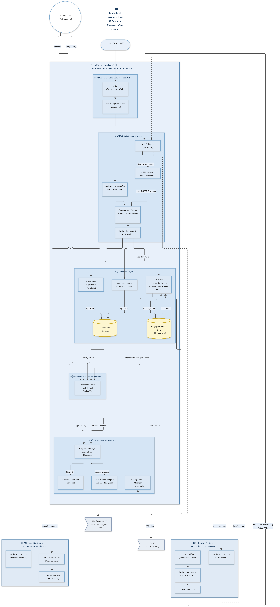
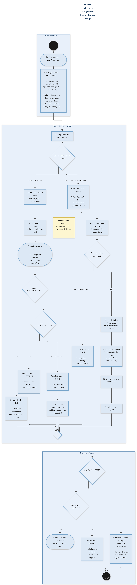
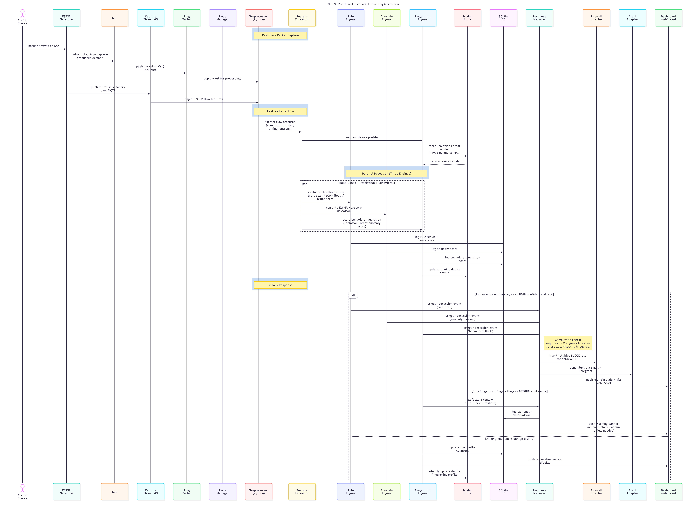

<div align="center">

# 🌐 IoT-IDS-Research-Proposals

### *Architectural Frameworks, Mathematical Models, and Engineering Specifications for Next-Generation Embedded, Distributed, and Privacy-Preserving IoT Intrusion Detection Systems*

<br>

[](LICENSE)
[](#-research-tracks--taxonomy)
[](https://www.raspberrypi.com/)
[](https://python.org)
[](https://scikit-learn.org/)
[](https://www.tcpdump.org/)
[](https://mosquitto.org/)
[](#-contributing)

<br>

[Repository Vision](#-repository-vision) •
[Research Taxonomy](#-research-tracks--taxonomy) •
[Track 1: Mini-IDS (Baseline)](#-track-1-mini-ids-embedded-baseline-prototype) •
[Track 2: BF-IDS (Distributed Hybrid)](#-track-2-bf-ids-behavioral-fingerprinting-embedded-ids) •
[Track 3: PPFL-IoT-IDS (Upcoming)](#-track-3-ppfl-iot-ids-privacy-preserving-federated-learning-ids) •
[Hardware Ecosystem](#-hardware-testbed--specifications) •
[Monorepo Structure](#-repository-layout) •
[Roadmap](#-unified-research--implementation-roadmap) •
[Documentation Index](#-documentation-index)

</div>

---

> [!IMPORTANT]
> **Research Repository Status:** This repository serves as the central research monorepo for advanced Internet of Things (IoT) Intrusion Detection System proposals, containing rigorous architectural blueprints, mathematical threat models, sequence diagrams, and engineering specifications.

---

## 🔬 Repository Vision

The explosive proliferation of Internet of Things (IoT) devices across consumer, healthcare, industrial, and smart-city infrastructures has introduced unprecedented cybersecurity vulnerabilities. Conventional Network Intrusion Detection Systems (NIDS) like Snort, Suricata, and Zeek were designed for high-performance servers, making them impractical for resource-constrained edge computing environments. Furthermore, traditional signature-based detection is fundamentally incapable of spotting zero-day exploits or inspecting encrypted (TLS 1.3/QUIC) communication streams.

This repository advances three progressive research paradigms to solve the edge security trilemma: **Detection Accuracy vs Resource Constraints vs Data Privacy**:

1. **Mini-IDS (Generation 1 - Baseline):** Single-node embedded IDS optimizing low-latency C/libpcap capture and deterministic rule-based defenses on a Raspberry Pi 4.
2. **BF-IDS (Generation 2 - Distributed Hybrid):** Integrates per-device unsupervised machine learning (Isolation Forest) with cheap distributed ESP32 edge sniffers to detect zero-day device compromises without decrypting payloads.
3. **PPFL-IoT-IDS (Generation 3 - Decentralized Federated):** Upcoming research proposal exploring Privacy-Preserving Federated Learning to enable collaborative cross-network threat modeling without centralizing sensitive private traffic.


```text
                               [ DETECTION ACCURACY ]
                            [ Track 2: BF-IDS (Gen 2) ]
                      (Multi-Engine ML & Distributed Sniffers)
                                         ^
                                       /   \
                                     /       \
                                   /           \
                                 /       *       \
                               /      THE IOT      \
                             /        SECURITY       \
                           /          TRILEMMA         \
                         /                               \
                       /                                   \
                     /                                       \
                   /                                           \
                 <----------------------------------------------->
       [ RESOURCE EFFICIENCY ]                           [ DATA PRIVACY ]
    [ Track 1: Mini-IDS (Gen 1) ]                  [ Track 3: PPFL-IoT-IDS (Gen 3) ]
  (Low-RAM, C Hot Path, Fast Rules)                 (Privacy-Preserving FL Concept)
```


---

## 📊 Research Tracks & Taxonomy

| Evaluation Vector | Track 1: Mini-IDS (Baseline) | Track 2: BF-IDS (Distributed Hybrid) | Track 3: PPFL-IoT-IDS (Upcoming) |
| :--- | :--- | :--- | :--- |
| **Research Scope** | Embedded Real-Time Packet Filtering | Distributed Behavioral Fingerprinting | Privacy-Preserving Federated Learning |
| **Development Order** | **Generation 1 (Foundational Prototype)** | **Generation 2 (Distributed & ML Evolution)** | **Generation 3 (Decentralized Privacy Frontier)** |
| **Architectural Topology** | Standalone Single-Node Embedded Hub | Master Hub (RPi 4) + Satellite Nodes (ESP32) | Decentralized Edge Mesh |
| **Detection Methodology** | Deterministic Rules + Statistical Thresholds | Rules + EWMA/Z-Score + Isolation Forest | Local Edge Learning + Global Aggregation |
| **Zero-Day Attack Detection** | **Low** (Limited to Statistical Spikes) | **High** (Per-Device Anomaly Scoring) | - |
| **Data Privacy Guarantees** | Metadata Flow Abstraction | Metadata Flow Abstraction (No DPI) | - |
| **Encrypted Payload Analysis** | Packet Rate and Volume Thresholds | Metadata Profiling (Timing/Size/Entropy) | - |
| **Target Hardware Platform** | Raspberry Pi 4 (Stand-Alone) | Raspberry Pi 4 + ESP32 Satellite Mesh | - |
| **Mitigation Mechanisms** | Automated `iptables` Drop + GPIO Alarm | Automated `iptables` Drop + GPIO Alarm | - |
| **Specification Document** | [Mini-IDS Personal Proposal](Mini-IDS_Project_Proposal/Mini-IDS_Personal_Project_Proposal.md) | [BF-IDS Technical Proposal](BF-IDS_Project_Proposal/BF-IDS_Project_Proposal.md) | [Research Note (In Progress)](PPFL-IoT-IDS_Research_Proposal/PPFL-IoT-IDS_Research_Proposal.md) |
| **Current Status** | Complete Baseline Specification | Complete Architecture & Specifications | Formulation in Progress |

---

## ⚡ Track 1: Mini-IDS (Embedded Baseline Prototype)

**Mini-IDS** represents the initial foundational prototype (Generation 1) that established the core packet capture, flow extraction, and automated mitigation mechanics for the entire research project.

### Core Concept & Implementation

Mini-IDS focuses on maximizing throughput and minimizing resource consumption on a standalone Raspberry Pi 4 without external satellite dependencies.

<div align="center">

<a href="Mini-IDS_Project_Proposal/Mini-IDS_Personal_Project_Proposal.md#Mini-IDS_architecture_diagram">
  
</a>

*Figure 1: Mini-IDS standalone embedded architecture with core processing modules and isolation boundaries.*

</div>

### Key Capabilities

* **Optimized libpcap Capture Hot Path:** C-based capture thread grabbing frames directly from the Network Interface Card (NIC) in promiscuous mode.
* **Deterministic Rule-Based Detection:** Fast-path detection for high-frequency port scans, ICMP floods, and repeated authentication brute-force attempts.
* **Lightweight Statistical Anomaly Checks:** Sliding-window EWMA calculations detecting volume surges and payload entropy irregularities.
* **Direct Hardware Alerts:** Immediate local notification through GPIO-connected buzzers and LEDs alongside administrative email and Telegram alerts.

<div align="center">

<a href="Mini-IDS_Project_Proposal/Mini-IDS_Personal_Project_Proposal.md#Mini-IDS_sequence_diagram">
  
</a>

*Figure 2: Mini-IDS real-time packet processing and administrative control sequence.*

</div>

* 📄 **Markdown Proposal:** [Mini-IDS Proposal Markdown](Mini-IDS_Project_Proposal/Mini-IDS_Personal_Project_Proposal.md)
* 📑 **Printable Documents:** [Mini-IDS PDF](Mini-IDS_Project_Proposal/Mini-IDS_Personal_Project_Proposal.pdf) • [Mini-IDS Word DOCX](Mini-IDS_Project_Proposal/Mini-IDS_Personal_Project_Proposal.docx)

---

## 🛡️ Track 2: BF-IDS (Behavioral Fingerprinting Embedded IDS)

Building directly upon the lessons learned from Mini-IDS, **BF-IDS** represents the second-generation multi-tiered embedded defense system designed for home, laboratory, and small-enterprise IoT networks.

### Core Architecture

<div align="center">

<a href="BF-IDS_Project_Proposal/BF-IDS_Project_Proposal.md#BF-IDS_architecture_diagram">
  
</a>

*Figure 3: Full BF-IDS embedded system architecture illustrating the Raspberry Pi 4 central coordinator, ESP32 satellite sniffers, multi-engine detection layer, and automated mitigation plane.*

</div>

### Key Architectural Highlights

* **Deterministic Zero-Copy Ingestion:** Packet capture implemented in C11 using `libpcap` combined with a lock-free circular ring buffer to safely stream frames to multiprocessing Python workers with zero lock contention.
* **Consensus-Gated Automated Mitigation:** Requires dual-detector agreement (such as rule engine plus fingerprint engine) before invoking automated kernel `iptables` drop rules, protecting against false-positive lockouts.
* **Distributed ESP32 Satellite Sensing:** Inexpensive ESP32 microcontrollers perform promiscuous Wi-Fi frame header sniffing and transmit JSON telemetry summaries over MQTT, expanding coverage across multiple network segments.
* **Real-Time Telemetry Dashboard:** WebSocket-powered Flask control surface providing streaming bandwidth charts, per-device fingerprint health indicators, and administrative threshold tuning.

### Behavioral Fingerprint Engine

Every IoT device possesses a characteristic communication pattern. BF-IDS models this behavior using an eight-dimensional continuous feature vector:

<div align="center">

<a href="BF-IDS_Project_Proposal/BF-IDS_Project_Proposal.md#BF-IDS_fingerprint_engine_diagram">
  
</a>

*Figure 4: State machine and analytical lanes of the Behavioral Fingerprint Engine.*

</div>

#### The 8-Dimensional Behavioral Feature Vector

1. `avg_packet_size`: Mean frame size characterizing device baseline traffic.
2. `packet_size_std`: Standard deviation of frame sizes (low for sensors, high for web clients).
3. `protocol_ratio`: Relative distribution across TCP, UDP, and ICMP transports.
4. `dominant_destinations`: Socket destination entropy identifying normal remote contacts.
5. `inter_arrival_time`: Transmission interval timing and jitter patterns.
6. `bytes_per_hour`: Volumetric throughput baselines across rolling windows.
7. `sleep_wake_pattern`: Circadian active versus quiet intervals based on time of day.
8. `new_dest_rate`: Velocity of connection attempts toward previously uncontacted IP addresses.

### Operational Sequence Diagrams

<div align="center">

<a href="BF-IDS_Project_Proposal/BF-IDS_Project_Proposal.md#BF-IDS_sequence_diagram_part1">
  
</a>

*Figure 5: Real-time packet ingestion, parallel evaluation, consensus gating, and enforcement flow.*

<br>

<a href="BF-IDS_Project_Proposal/BF-IDS_Project_Proposal.md#BF-IDS_sequence_diagram_part2">
  
</a>

*Figure 6: Administrative alert handling, model retraining lifecycle, and ESP32 heartbeat telemetry flow.*

</div>

* 📘 **Full Technical Proposal:** [BF-IDS Technical Proposal Document](BF-IDS_Project_Proposal/BF-IDS_Project_Proposal.md)
* 📊 **High-Resolution Schematics:** [BF-IDS Assets Directory](BF-IDS_Project_Proposal/assets/)

---

## 🔮 Track 3: PPFL-IoT-IDS (Privacy-Preserving Federated Learning IDS)

### *Active Research Direction: Conceptual Formulation in Progress*

Representing the third generation of our research roadmap, **PPFL-IoT-IDS** investigates decentralized, collaborative intrusion detection for privacy-sensitive Internet of Things environments.

#### Core Research Motivation
Isolated intrusion detection deployments face a fundamental trade-off: machine learning models need broad, diverse threat datasets to detect emerging global attacks, but sharing raw packet data across private organizations (smart homes, healthcare facilities, industrial systems) is strictly prohibited by data privacy regulations and proprietary security policies.

#### Research Vision
* **Decentralized Collaborative Intelligence:** Exploring federated learning paradigms where edge devices train local intrusion detection models on their own traffic and only exchange abstracted parameter updates.
* **Privacy-First Model Exchange:** Formulating privacy-preserving mechanisms to prevent model inversion or data leakage during collaborative model aggregation.
* **Heterogeneous Edge Scalability:** Investigating communication-efficient synchronization tailored to resource-constrained IoT devices with intermittent connectivity.

> [!NOTE]
> Detailed architectural schematics, mathematical formulations, threat models, and experimental evaluation plans for PPFL-IoT-IDS are currently being formulated. Track ongoing progress in the [PPFL-IoT-IDS Research Document](PPFL-IoT-IDS_Research_Proposal/PPFL-IoT-IDS_Research_Proposal.md).

---

## 💻 Hardware Testbed & Specifications

The research proposals in this repository are designed for validation on realistic, cost-effective embedded hardware:

| Component | Target Hardware Specification | Role in Research Testbed | Est. Cost (USD) |
| :--- | :--- | :--- | :--- |
| **Primary Edge Coordinator** | Raspberry Pi 4 Model B (4 GB RAM, ARM64) | Capture hot path, local ML inference, and dashboard | ~$110 |
| **Distributed Edge Sniffers** | ESP32-WROOM-32 DevKit V1 (Dual-Core) | Promiscuous 802.11 sniffing and MQTT telemetry bridge | ~$11 |
| **High-Endurance Storage** | SanDisk Extreme 32 GB MicroSD (A2, V30) | WAL-mode SQLite database, logs, and model storage | ~$9 |
| **Physical Alarm Peripherals**| 5V Active Buzzer + High-Intensity Red LEDs | Hardware GPIO perimeter notification testbed | ~$2 |
| **Power Infrastructure** | 5V 3A USB-C PSU + Micro-B Cable + Heatsinks | Sustained thermal management and stable power supply | ~$11 |
| **Total Estimated Cost** | **Complete Multi-Node Embedded IDS Setup** | **Full Physical Testbed Deployment** | **~$143** |

---

## 📁 Repository Layout

```text
IoT-IDS-Research-Proposals/
├── README.md                                  # Central research portal and cross-proposal navigation
├── LICENSE                                    # Open-source MIT License
│
├── Mini-IDS_Project_Proposal/                 # Track 1: Embedded Baseline Prototype (Generation 1)
│   ├── Mini-IDS_Personal_Project_Proposal.md  # Original personal project proposal text
│   ├── Mini-IDS_Personal_Project_Proposal.pdf # Printable PDF document
│   ├── Mini-IDS_Personal_Project_Proposal.docx# Word version
│   └── assets/
│       ├── Architecture_Diagram.png           # Standalone baseline architecture
│       └── Sequence_Diagram.png               # Standalone baseline sequence flow
│
├── BF-IDS_Project_Proposal/                   # Track 2: Behavioral Fingerprinting Embedded IDS (Generation 2)
│   ├── BF-IDS_Project_Proposal.md             # Complete 600+ line technical proposal
│   └── assets/                                # High-resolution architectural schematics
│       ├── architecture_diagram_new.png
│       ├── fingerprint_engine_diagram_new.png
│       ├── sequence_diagram_part1_new.png
│       └── sequence_diagram_part2_new.png
│
├── PPFL-IoT-IDS_Research_Proposal/            # Track 3: Privacy-Preserving Federated Learning (Generation 3 - In Progress)
│   └── PPFL-IoT-IDS_Research_Proposal.md      # Research proposal draft (in progress)
│
└── .github/
    └── workflows/
        └── ci.yml                             # Automated documentation testing and link verification
```

---

## 🗺️ Unified Research & Implementation Roadmap

```
[ Phase 1: Baseline Prototype ]  ✅ Mini-IDS single-node architecture and baseline specifications completed
              │
[ Phase 2: Distributed Hybrid ]  ✅ BF-IDS multi-engine architecture, Isolation Forest design, and ESP32 specs completed
              │
[ Phase 3: Core Capture Hot Path]⏳ Low-latency C/libpcap hot path and lock-free ring buffer implementation on RPi 4
              │
[ Phase 4: Decentralized Privacy]🔄 PPFL-IoT-IDS conceptual formulation, threat modeling, and proposal draft
              │
[ Phase 5: Privacy Validation   ]📅 Model evaluation and collaborative communication efficiency benchmarking
              │
[ Phase 6: Multi-Node Benchmark ]📅 Physical multi-node deployment, latency profiling, and academic dataset evaluations
```

---

## 📖 Documentation Index

| Research Document | Format | Description | Quick Link |
| :--- | :---: | :--- | :--- |
| **Mini-IDS Proposal Document** | Markdown | Single-node baseline proposal (Generation 1) | [Read Proposal](Mini-IDS_Project_Proposal/Mini-IDS_Personal_Project_Proposal.md) |
| **Mini-IDS Printable PDF** | PDF Document | Formatted printable submission | [Open PDF](Mini-IDS_Project_Proposal/Mini-IDS_Personal_Project_Proposal.pdf) |
| **BF-IDS Technical Proposal** | Markdown | Complete multi-engine and distributed design (Generation 2) | [Read Proposal](BF-IDS_Project_Proposal/BF-IDS_Project_Proposal.md) |
| **BF-IDS Visual Assets** | PNG Schematics | High-resolution architectural diagrams | [View Assets](BF-IDS_Project_Proposal/assets/) |
| **PPFL-IoT-IDS Research Note** | Markdown | Conceptual formulation (Generation 3) | [Read Draft](PPFL-IoT-IDS_Research_Proposal/PPFL-IoT-IDS_Research_Proposal.md) |

---

## 🤝 Contributing

We welcome discussions, reviews, and collaborative research contributions from embedded systems engineers, machine learning specialists, and cybersecurity researchers.

1. Fork the Repository (`git checkout -b feature/ResearchImprovement`).
2. Commit your contributions (`git commit -m "docs: Refine research proposal"`).
3. Push to your branch (`git push origin feature/ResearchImprovement`).
4. Submit a Pull Request describing your research enhancements.

---

## 📄 License

All research proposals and documentation in this repository are distributed under the **MIT License**. See [LICENSE](LICENSE) for details.

---

<div align="center">

**Lead Researcher: Sagar Biswas**

*Supervised by _______.*

*Department of Computer Science and Engineering*

<br>

⭐ **If you find these IoT security architectures and research proposals valuable, please star this repository!**

</div>